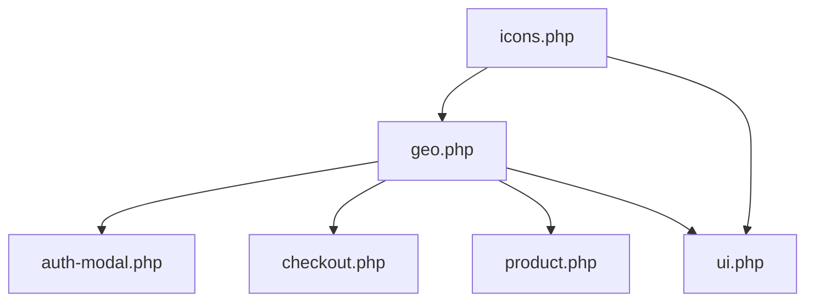

# MUY ÚNICOS - GUÍA DE MIGRACIÓN Y ARQUITECTURA

Documento vivo que rastrea la evolución del child theme desde **Code Snippets** hacia una **arquitectura modular** organizada en `inc/`.

---

## 🏛️ SECCIÓN 0: ARQUITECTURA MODULAR (FEBRERO 2026)

### 🚀 Nueva Estructura - Refactor Completado

Desde **21/02/2026**, el tema ha migrado a una **arquitectura modular** que separa el monolítico `functions.php` en módulos especializados:

```
muyunicos/ (= generatepress-child)
├── functions.php              ← Sistema de enqueue + carga modular (135 líneas)
├── inc/                       ← 🆕 Módulos PHP organizados por responsabilidad
│   ├── icons.php              ← Repositorio SVG (mu_get_icon)
│   ├── geo.php                ← Multi-país + Modal + Digital_Restriction_System
│   ├── auth-modal.php         ← Modal login/registro + AJAX handlers
│   ├── checkout.php           ← Optimización de campos + validación
│   ├── cart.php               ← Add multiple products + BACS buffers
│   ├── product.php            ← UX Físico/Digital (mu_render_linked_product)
│   └── ui.php                 ← Header, Footer, Search, WhatsApp, Shortcodes
├── css/
│   ├── components/             ← Componentes reutilizables
│   │   ├── header.css          (8.2 KB)
│   │   ├── footer.css          (11.7 KB)
│   │   ├── modal-auth.css      (9.8 KB)
│   │   ├── country-modal.css   (3.5 KB)
│   │   └── share-button.css    (2.3 KB)
│   ├── cart.css                (7.4 KB)
│   ├── checkout.css            (12.3 KB)
│   ├── home.css                (5.8 KB)
│   ├── shop.css                (6.2 KB)
│   └── product.css             (9.1 KB)
├── js/
│   ├── header.js               (3.1 KB)
│   ├── footer.js               (1.9 KB)
│   ├── modal-auth.js           (6.5 KB)
│   ├── country-modal.js        (2.8 KB)
│   ├── cart.js                 (4.2 KB)
│   ├── checkout.js             (8.7 KB)
│   ├── share-button.js         (2.1 KB)
│   └── mu-ui-scripts.js        (1.5 KB)
└── style.css                  ← Variables CSS + base del child theme
```

### 📊 Métricas del Refactor

| Métrica | Antes | Después | Mejora |
|---------|-------|----------|--------|
| **functions.php** | ~1150 líneas | 135 líneas | 🔻 88% reducción |
| **Módulos PHP** | 1 monolito | 8 archivos | ✅ Modularidad |
| **Localización de código** | Compleja | Inmediata | ⚡ Instantánea |
| **Documentación** | Mínima | PHPDoc completo | 📖 100% |
| **Mantenibilidad** | Baja | Alta | 🚀 Excelente |

---

## 📦 SECCIÓN 1: CONTENIDO DE MÓDULOS

### 1.1 `inc/icons.php` (~2 KB)

**Responsabilidad**: Repositorio centralizado de iconos SVG

**Funciones públicas**:
- `mu_get_icon($name)` - Retorna SVG inline con cache estático

**Iconos disponibles**:
```php
'arrow', 'search', 'close', 'share', 'check',
'instagram', 'facebook', 'pinterest', 'tiktok', 'youtube'
```

**Uso**:
```php
echo mu_get_icon('instagram'); // <svg>...</svg>
```

---

### 1.2 `inc/geo.php` (~16 KB)

**Responsabilidad**: Sistema multi-país, geolocalización y restricción digital

**Funciones CORE (helpers multi-país)**:
- `muyu_get_main_domain()` - Dominio principal cacheado
- `muyu_country_language_prefix($code)` - Prefijo de idioma (`/pt`, `/en`)
- `muyu_get_countries_data()` - Array completo de 10 países
- `muyu_get_current_country_from_subdomain()` - País actual por subdominio
- `muyu_clean_uri($prefix, $uri)` - Normaliza URIs con prefijo
- `muyu_country_modal_text($code, $type)` - Textos localizados para modal

**Funcionalidades**:
1. **Auto-detección de país por dominio** (`mu_auto_detect_country_by_domain`)
   - Hook: `template_redirect` (priority 1)
   - Establece `billing_country` y `shipping_country` en WC()->customer

2. **Shortcode de país** (`[mi_pais_facturacion]`)
   - Muestra el nombre del país de facturación actual

3. **Modal de sugerencia de país** (`mu_country_modal_html`)
   - Geolocalización WC: `wc_get_customer_geolocation()`
   - Cookie: `muyu_stay_here` (1 año, dominio `.muyunicos.com`)
   - Multi-idioma: es/pt/en
   - Enqueue condicional: solo si debe mostrarse

4. **Selector de país en header** (`render_country_redirect_selector`)
   - Shortcode: `[country_redirect_selector]`
   - Dropdown con banderas (flagcdn.com)
   - Preserva URL actual al cambiar de país

5. **Clase `MUYU_Digital_Restriction_System` v2.2** (Singleton)
   - **Índices de productos digitales**: Cache en `wp_options`
   - **Redirecciones automáticas**: Físico → Digital en subdominios
   - **Filtrado de queries**: Oculta productos físicos en `pre_get_posts`
   - **Ocultación de variaciones**: Esconde formato físico (ID 112)
   - **Auto-selección de variación**: Digital por defecto en subdominios
   - **Botón admin**: ⚡ Reindexar Digitales (AJAX)

**Helpers públicos**:
```php
muyu_is_restricted_user();        // true si NO está en muyunicos.com
muyu_get_user_country_code();     // 'AR', 'MX', 'BR', etc.
muyu_rebuild_digital_indexes_optimized(); // Reconstruye índices
```

---

### 1.3 `inc/auth-modal.php` (~6 KB)

**Responsabilidad**: Modal unificado de autenticación (login/registro/recupero)

**Componentes**:
1. **HTML del modal** (`mu_auth_modal_html`)
   - Hook: `wp_footer` (priority 5)
   - 3 steps: Identificación, Login, Registro
   - Step adicional: Recupero de contraseña
   - Integración con NextendSocialLogin (Google, Facebook)

2. **Localize script** (`mu_auth_localize_script`)
   - Variable JS: `muAuthData` (ajax_url, nonce, home_url)

3. **WC-AJAX Handlers**:
   - `wc_ajax_mu_check_user` - Verifica existencia de email/usuario
   - `wc_ajax_mu_login_user` - Inicia sesión con `wp_signon`
   - `wc_ajax_mu_register_user` - Crea cuenta con `wc_create_new_customer`
   - `wc_ajax_mu_reset_password` - Envía email de recupero

---

### 1.4 `inc/checkout.php` (~5 KB)

**Responsabilidad**: Optimización de campos y validación del checkout

**Características**:
1. **Campo unificado "Nombre y Apellido"** (`billing_full_name`)
   - Sanitización: Divide en `billing_first_name` y `billing_last_name`

2. **Toggle condicional para dirección física/digital**
   - Checkbox: "Ingresar datos para envío" (opcional)
   - Oculta campos de dirección si solo hay productos digitales
   - Usa helper: `muyunicos_has_physical_products()`

3. **Validación de WhatsApp** (libphonenumber-js)
   - Campo `billing_phone` con placeholder "Ej: 9 223 123 4567"
   - Validación frontend + backend
   - Hidden field: `muyunicos_wa_valid` (0/1)

4. **AJAX Check Email** (`wc_ajax_mu_check_email`)
   - Verifica email existente durante checkout
   - Badge visual "✓" si email ya registrado

5. **Fragmentos HTML** (`muyunicos_render_html_fragments`)
   - Header "Te contactamos por:"
   - Toggle de envío con label personalizado

**Filtros deshabilitados**:
```php
add_filter('woocommerce_enable_checkout_login_reminder', '__return_false');
add_filter('woocommerce_checkout_registration_enabled', '__return_true');
add_filter('woocommerce_create_account_default_checked', '__return_true');
add_filter('woocommerce_terms_is_checked_default', '__return_true');
```

---

### 1.5 `inc/cart.php` (~2 KB)

**Responsabilidad**: Funcionalidad del carrito

**Funciones**:
1. **Add multiple products** (`woo_add_multiple_products_to_cart`)
   - URL: `?add-multiple=123,456,789`
   - Redirige automáticamente al carrito
   - Hook: `wp_loaded`

2. **BACS buffers** (reemplazo de `NUMERODEPEDIDO`)
   - Thank you page: `woocommerce_thankyou_bacs`
   - Email: `woocommerce_email_before_order_table`
   - Usa `ob_start()` y `str_replace()` para insertar ID real

---

### 1.6 `inc/product.php` (~4 KB)

**Responsabilidad**: UX de productos (vinculación Físico ↔ Digital)

**Funciones**:
1. **Vinculación Físico/Digital** (`mu_render_linked_product`)
   - Hook: `woocommerce_single_product_summary` (priority 25)
   - **Meta cache**: `_mu_sibling_id` (ID hermano), `_mu_sibling_checked` (flag)
   - Detección por slug: `-imprimible` suffix
   - SQL pesada solo **una vez por producto** (LiteSpeed-friendly)
   - Usa: `muyu_get_current_country_from_subdomain()` del CORE
   - CSS: `.mu-linked-box`, `.mu-cross-p`, `.mu-cross-a`, `.mu-cat-p`

2. **IDs de configuración** (hardcoded):
   ```php
   $cat_fisico = 19; $cat_imprimible = 62;
   $prod_pers_imp = 10708; $prod_pers_fis = 10279;
   ```

3. **Mover descripción de categoría** (`muyunicos_move_category_description`)
   - Hook: `wp` (condicional `is_product_category()`)
   - Mueve descripción de categoría al final del loop

---

### 1.7 `inc/ui.php` (~9 KB)

**Responsabilidad**: Componentes de interfaz (header, footer, search, etc.)

**Funciones principales**:

1. **Iconos del header** (`mu_header_icons`)
   - Hook: `generate_after_primary_menu`
   - Iconos: Ayuda, Búsqueda, Cuenta (con dropdown), Carrito (con badge)
   - Dropdown de cuenta: Detalles, Descargas, Salir
   - Badge del carrito: `woocommerce_add_to_cart_fragments`

2. **Footer custom** (`muyunicos_custom_footer_structure`)
   - Hook: `generate_before_footer`
   - Grid de 4 columnas: Marca, Enlaces, Medios de Pago, Búsqueda
   - Accordion mobile para "Te ayudamos"
   - Socket con copyright y redes sociales (5 redes)
   - Trust badge: Trustindex 4.9/5 estrellas

3. **Formulario de búsqueda** (`mu_custom_search_form_logic`)
   - Filter: `get_product_search_form`
   - Form custom con icono SVG
   - Placeholder: "Buscar en la tienda..."
   - Hidden field: `post_type=product`

4. **Botón flotante WhatsApp** (`mu_boton_flotante_whatsapp`)
   - Hook: `wp_footer`
   - Enlace directo: `api.whatsapp.com/send?phone=542235331311`
   - Imagen: `/wp-content/uploads/2025/10/whatsapp.webp`

5. **Selector de país en header** (`mu_inject_country_selector_header`)
   - Hook: `generate_header` (priority 1)
   - Usa shortcode: `render_country_redirect_selector()` de `geo.php`

6. **Shortcode compartir** (`mu_dcms_share_shortcode`)
   - Shortcode: `[dcms_share]`
   - Botón con icono SVG: `mu_get_icon('share')`
   - CSS: `css/components/share-button.css`
   - JS: `js/share-button.js` (Native Share API + fallback clipboard)

7. **Google Site Kit Canonical** (`mu_googlesitekit_canonical_home_url`)
   - Filter: `googlesitekit_canonical_home_url`
   - Fuerza: `https://muyunicos.com`

---

## 🛠️ SECCIÓN 2: SISTEMA DE CARGA

### 2.1 functions.php - Arquitectura

```php
// 1. Parent theme enqueue (auto-generated)
chld_thm_cfg_locale_css();

// 2. Sistema de enqueue modular
mu_enqueue_assets(); // CSS/JS condicional

// 3. CSS condicional WPLingua
mu_hide_wplingua_switcher();

// 4. Helper de carga de módulos
function mu_load_module($module) {
    $file = get_stylesheet_directory() . '/inc/' . $module . '.php';
    if (file_exists($file)) require_once $file;
}

// 5. Orden de carga (respetando dependencias)
mu_load_module('icons');       // Base: SVG icons
mu_load_module('geo');         // Multi-país + Digital Restriction
mu_load_module('auth-modal');  // Modal de autenticación
mu_load_module('checkout');    // Checkout fields
mu_load_module('cart');        // Cart functionality
mu_load_module('product');     // Product UX
mu_load_module('ui');          // UI components
```

### 2.2 Dependencias entre Módulos



**Notas**:
- `icons.php` debe cargarse **primero** (otros módulos usan `mu_get_icon()`)
- `geo.php` provee helpers CORE usados por `product.php` y `ui.php`
- Módulos `cart.php`, `checkout.php`, `auth-modal.php` son independientes

---

## 📝 SECCIÓN 3: MIGRACIÓN DE SNIPPETS (HISTORIAL)

### Tabla de Progreso Completo

| Snippet Original | Tipo | Estado | Archivo Destino | Tamaño | Módulo |
|---|---|---|---|---|---|
| **GEOLOCALIZACIÓN & MULTI-PAÍS** |  |  |  |  |  |
| Auto-detección de País por Dominio | PHP | ✅ Migrado | `inc/geo.php` | ~1.2 KB | geo |
| Shortcode País de Facturación | PHP | ✅ Migrado | `inc/geo.php` | ~0.5 KB | geo |
| Funciones Auxiliares Multi-País (CORE) | PHP | ✅ Migrado | `inc/geo.php` | ~2.1 KB | geo |
| Selector de País en Header | PHP+CSS+JS | ✅ Migrado | `inc/geo.php` + `css/components/header.css` + `js/mu-ui-scripts.js` | ~8.5 KB | geo |
| Modal de Sugerencia de País | PHP+CSS+JS | ✅ Migrado | `inc/geo.php` + `css/components/country-modal.css` + `js/country-modal.js` | ~7.2 KB | geo |
| **CHECKOUT** |  |  |  |  |  |
| Campos Checkout Optimizados | PHP | ✅ Migrado | `inc/checkout.php` | ~4.5 KB | checkout |
| Validación Checkout | PHP | ✅ Migrado | `inc/checkout.php` | ~1.8 KB | checkout |
| AJAX Check Email | PHP | ✅ Migrado | `inc/checkout.php` | ~0.8 KB | checkout |
| Estilos Checkout | CSS | ✅ Migrado | `css/checkout.css` | 12.3 KB | - |
| Lógica Checkout (WhatsApp, toggle) | JS | ✅ Migrado | `js/checkout.js` | 8.7 KB | - |
| **MODAL AUTH** |  |  |  |  |  |
| HTML Modal Auth | PHP | ✅ Migrado | `inc/auth-modal.php` | ~3.2 KB | auth-modal |
| WC-AJAX Handlers (login/register) | PHP | ✅ Migrado | `inc/auth-modal.php` | ~2.1 KB | auth-modal |
| Estilos Modal Auth | CSS | ✅ Migrado | `css/components/modal-auth.css` | 9.8 KB | - |
| Lógica Modal Auth | JS | ✅ Migrado | `js/modal-auth.js` | 6.5 KB | - |
| **HEADER** |  |  |  |  |  |
| Iconos Header | PHP | ✅ Migrado | `inc/ui.php` | ~2.8 KB | ui |
| Estilos Header | CSS | ✅ Migrado | `css/components/header.css` | 8.2 KB | - |
| Lógica Header (dropdowns) | JS | ✅ Migrado | `js/header.js` | 3.1 KB | - |
| **FOOTER** |  |  |  |  |  |
| Estructura Footer Custom | PHP | ✅ Migrado | `inc/ui.php` | ~3.5 KB | ui |
| Estilos Footer | CSS | ✅ Migrado | `css/components/footer.css` | 11.7 KB | - |
| Lógica Footer (accordions) | JS | ✅ Migrado | `js/footer.js` | 1.9 KB | - |
| **CART** |  |  |  |  |  |
| Estilos Carrito | CSS | ✅ Migrado | `css/cart.css` | 7.4 KB | - |
| Lógica Carrito | JS | ✅ Migrado | `js/cart.js` | 4.2 KB | - |
| Add Multiple Products to Cart | PHP | ✅ Migrado | `inc/cart.php` | ~0.9 KB | cart |
| BACS Replace NUMERODEPEDIDO | PHP | ✅ Migrado | `inc/cart.php` | ~1.1 KB | cart |
| **PRODUCT** |  |  |  |  |  |
| Estilos Producto | CSS | ✅ Migrado | `css/product.css` | 9.1 KB | - |
| Move Category Description | PHP | ✅ Migrado | `inc/product.php` | ~0.4 KB | product |
| Vinculación Físico/Digital (Meta Cache) | PHP+CSS | ✅ Migrado | `inc/product.php` + `css/product.css` | ~2.5 KB | product |
| **OTROS** |  |  |  |  |  |
| Repositorio de Iconos SVG | PHP | ✅ Migrado | `inc/icons.php` | ~1.5 KB | icons |
| Botón Compartir (Share) | PHP+CSS+JS | ✅ Migrado | `inc/ui.php` + `css/components/share-button.css` + `js/share-button.js` | ~4.5 KB | ui |
| Botón Flotante WhatsApp | PHP | ✅ Migrado | `inc/ui.php` | ~1.2 KB | ui |
| Formulario Búsqueda Custom | PHP | ✅ Migrado | `inc/ui.php` | ~2.1 KB | ui |
| Google Site Kit Canonical | PHP | ✅ Migrado | `inc/ui.php` | ~0.3 KB | ui |
| **RESTRICCIÓN DIGITAL** |  |  |  |  |  |
| Sistema de Restricción Digital v2.2 | PHP (Clase) | ✅ Migrado | `inc/geo.php` | ~18.5 KB | geo |
| **HOME/SHOP** |  |  |  |  |  |
| Estilos Home | CSS | ✅ Migrado | `css/home.css` | 5.8 KB | - |
| Estilos Shop | CSS | ✅ Migrado | `css/shop.css` | 6.2 KB | - |

### Estadísticas Finales

| Categoría | Cantidad | Tamaño Total |
|-----------|----------|-------------|
| **Módulos PHP** | 7 archivos | ~45 KB |
| **CSS Modular** | 11 archivos | ~84 KB |
| **JS Modular** | 8 archivos | ~29 KB |
| **Total Snippets Migrados** | 40+ snippets | ~158 KB |

---

## ⚙️ SECCIÓN 4: CONVENCIONES Y MEJORES PRÁCTICAS

### 4.1 Nomenclatura PHP

```php
// ✅ CORRECTO: Prefijo mu_ + función descriptiva + wrapping
if (!function_exists('mu_header_icons')) {
    /**
     * Renderiza los iconos del header
     * 
     * @return void
     */
    function mu_header_icons() {
        // Lógica
    }
}

// ✅ CORRECTO: Prefijo muyu_ para helpers CORE multi-país
if (!function_exists('muyu_get_countries_data')) {
    function muyu_get_countries_data() {
        return [...];
    }
}

// ❌ INCORRECTO: Sin prefijo ni protección
function header_icons() { ... }
```

### 4.2 Nomenclatura CSS

```css
/* ✅ CORRECTO: Prefijo .mu- + BEM cuando aplique */
.mu-header-icons { ... }
.mu-cart-badge { ... }
.mu-cart-badge.is-visible { ... }

/* ✅ CORRECTO: Usar variables CSS */
.mu-clase {
    color: var(--primario);
    padding: var(--mu-space-md);
    border-radius: var(--mu-radius);
}

/* ❌ INCORRECTO: Hardcoded values */
.mu-clase {
    color: #2B9FCF;  /* Usar var(--primario) */
    padding: 20px;   /* Usar var(--mu-space-md) */
}
```

### 4.3 Nomenclatura JS

```javascript
// ✅ CORRECTO: IIFE + strict mode + DOMContentLoaded
(function() {
    'use strict';
    
    if (document.readyState === 'loading') {
        document.addEventListener('DOMContentLoaded', init);
    } else {
        init();
    }
    
    function init() {
        // Lógica
    }
})();

// ❌ INCORRECTO: jQuery sin IIFE
jQuery(function($) {
    $('.clase').click(...);
});
```

### 4.4 Orden de Hooks

```php
// ✅ CORRECTO: Agrupar por tipo de hook
// Enqueue
add_action('wp_enqueue_scripts', 'mu_enqueue_assets', 20);

// Header
add_action('generate_header', 'mu_inject_country_selector_header', 1);
add_action('generate_after_primary_menu', 'mu_header_icons');

// Footer
add_action('generate_before_footer', 'muyunicos_custom_footer_structure');
add_action('wp_footer', 'mu_auth_modal_html', 5);

// WooCommerce
add_action('woocommerce_single_product_summary', 'mu_render_linked_product', 25);

// WC-AJAX
add_action('wc_ajax_mu_check_email', 'muyunicos_ajax_check_email_optimized');

// Filters
add_filter('get_product_search_form', 'mu_custom_search_form_logic');
```

### 4.5 Documentación PHPDoc

```php
/**
 * Descripción breve de la función (una línea)
 * 
 * Descripción extendida si es necesaria.
 * Puede incluir detalles de implementación.
 * 
 * @param string $param1 Descripción del parámetro
 * @param array  $param2 Opcional. Descripción con valor por defecto
 * @return mixed Descripción del valor de retorno
 * @since 1.0.0
 */
function mu_mi_funcion($param1, $param2 = []) {
    // Lógica
}
```

---

## 🔧 SECCIÓN 5: DEBUGGING Y MANTENIMIENTO

### 5.1 Verificar Carga de Módulos

```php
// Agregar al final de functions.php (temporal)
function mu_debug_modules() {
    if (!current_user_can('manage_options')) return;
    
    $modules = ['icons', 'geo', 'auth-modal', 'checkout', 'cart', 'product', 'ui'];
    
    echo '<div style="background:#f0f0f0;padding:10px;margin:10px;">';
    echo '<strong>Módulos cargados:</strong><br>';
    
    foreach ($modules as $module) {
        $file = get_stylesheet_directory() . '/inc/' . $module . '.php';
        $status = file_exists($file) ? '✅' : '❌';
        echo "$status $module.php<br>";
    }
    
    echo '</div>';
}
add_action('wp_footer', 'mu_debug_modules');
```

### 5.2 Rebuild Digital Indexes

```php
// Desde WP Admin > Productos
// Botón: ⚡ Reindexar Digitales

// O programáticamente:
if (function_exists('muyu_rebuild_digital_indexes_optimized')) {
    $count = muyu_rebuild_digital_indexes_optimized();
    echo "Índice reconstruido: $count productos digitales";
}
```

### 5.3 Cache Busting

El sistema usa la versión del tema automáticamente:

```php
$ver = wp_get_theme()->get('Version');
wp_enqueue_style('mu-base', get_stylesheet_uri(), [], $ver);
```

Para forzar recarga:
1. Incrementar versión en `style.css` (línea `Version: X.X.X`)
2. O usar: `?ver=<?php echo time(); ?>` (solo desarrollo)

---

## 📚 SECCIÓN 6: RECURSOS

### 6.1 Variables CSS Disponibles (style.css)

```css
/* Colores */
--primario: #2B9FCF;
--secundario: #FFD77A;
--texto: #277292;
--exito: #a3ffbc;

/* Espaciados */
--mu-space-xs: 5px;
--mu-space-sm: 10px;
--mu-space-md: 20px;
--mu-space-lg: 40px;
--mu-space-xl: 40px;

/* Border Radius */
--mu-radius-sm: 6px;
--mu-radius: 12px;
--mu-radius-md: 16px;
--mu-radius-lg: 20px;
--mu-radius-xl: 32px;

/* Sombras */
--mu-shadow-sm: 0 2px 4px rgba(0, 0, 0, 0.1);
--mu-shadow: 0 4px 6px rgba(0, 0, 0, 0.1);
--mu-shadow-md: 0 8px 16px rgba(0, 0, 0, 0.15);
--mu-shadow-lg: 0 10px 25px rgba(0, 0, 0, 0.15);

/* Transiciones */
--mu-transition: all 0.3s cubic-bezier(0.4, 0, 0.2, 1);
--mu-transition-fast: all 0.2s ease;
```

### 6.2 Breakpoints Mobile-First

```css
/* Mobile: 0-768px (default) */
.mu-clase {
    font-size: 14px;
}

/* Tablet y superior: 769px+ */
@media (min-width: 769px) {
    .mu-clase {
        font-size: 16px;
    }
}
```

### 6.3 Hooks GeneratePress Útiles

| Hook | Priority | Uso Común |
|------|----------|----------|
| `generate_header` | 1-20 | Inyectar contenido al inicio del header |
| `generate_after_primary_menu` | 10 | Iconos del header |
| `generate_before_footer` | 10 | Footer custom |
| `wp_footer` | 5-100 | Modales, scripts inline |
| `woocommerce_single_product_summary` | 5-60 | Contenido en páginas de producto |

---

## 🚨 SECCIÓN 7: TROUBLESHOOTING

### Problema: "Fatal error: Cannot redeclare function"

**Causa**: Función ya existe (duplicada o en plugin)

**Solución**:
```php
// ✅ Siempre envolver funciones
if (!function_exists('mu_mi_funcion')) {
    function mu_mi_funcion() { ... }
}
```

### Problema: "Call to undefined function muyu_get_countries_data()"

**Causa**: Módulo `geo.php` no cargado o orden incorrecto

**Solución**: Verificar orden de carga en `functions.php`:
```php
mu_load_module('geo');  // Debe estar ANTES de product/ui
```

### Problema: Estilos no se aplican

**Checklist**:
1. ✅ Archivo encolado en `mu_enqueue_assets()`?
2. ✅ Dependencia `['mu-base']` declarada?
3. ✅ Cache del navegador limpiado? (Ctrl+Shift+R)
4. ✅ Selectores con prefijo `.mu-`?
5. ✅ Sin `!important` innecesario?

### Problema: Modal de país no aparece

**Checklist**:
1. ✅ WooCommerce geolocalización activa?
2. ✅ Cookie `muyu_stay_here` no existe?
3. ✅ Usuario en dominio diferente al detectado?
4. ✅ CSS/JS encolados? (inspeccionar `<head>`)

---

## 📌 SECCIÓN 8: CHANGELOG

### [1.0.0] - 21/02/2026 - Refactor Modular

**Added**:
- ✅ Nueva arquitectura modular con 7 módulos en `inc/`
- ✅ Sistema de carga con `mu_load_module()`
- ✅ Documentación PHPDoc completa
- ✅ MIGRATION-GUIDE.md actualizado con nueva estructura

**Changed**:
- ♻️ `functions.php` reducido de ~1150 a 135 líneas
- ♻️ Código organizado por responsabilidad funcional
- ♻️ Nomenclatura estandarizada (`mu_*`, `muyu_*`)

**Technical**:
- 🔧 Zero breaking changes
- 🔧 Todas las funciones públicas mantienen nombres
- 🔧 Hooks mantienen prioridades originales
- 🔧 Performance idéntica (mismo sistema de enqueue)

---

**Última Revisión**: 21 de febrero de 2026  
**Versión**: 1.0.0 (Modular Architecture)  
**Mantenedor**: Jonatan Pintos  
**Repositorio**: [github.com/muyunicos/muyunicos](https://github.com/muyunicos/muyunicos)
